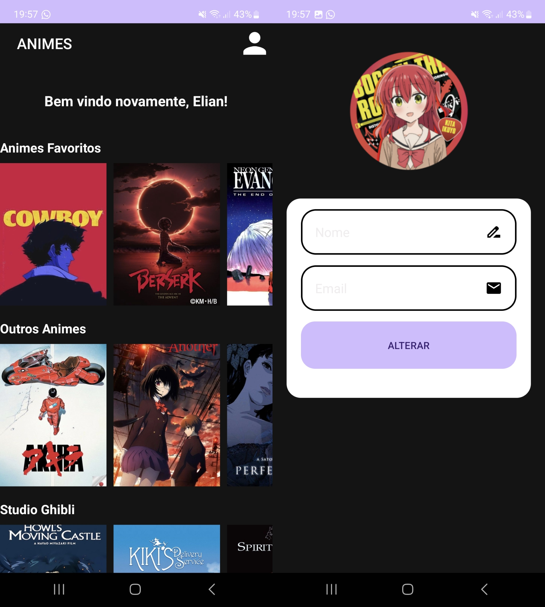

# Projeto: Catálogo de Animes

Este projeto é uma Atividade Prática para entrega Presencial do curso de Dispositivos Móveis. Ele consiste em um aplicativo de catálogo de animes, proporcionando uma experiência semelhante à da Netflix, com rolagens horizontais e uma lista de animes dispostos verticalmente.

    

## Lógica do Código

O código do projeto está organizado de forma a permitir a navegação entre duas atividades principais: `MainActivity` e `SobreActivity`.

### `MainActivity`

- A `MainActivity` representa a tela principal do aplicativo, onde posters dos animes estão listados.
- Cada anime é representado como um item na lista, com rolagem horizontal para explorar diferentes animes dentro de uma categoria.

### `SobreActivity`

- A `SobreActivity` permite ao usuário alterar seu nome e email.
- O novo nome é enviado de volta para a `MainActivity` através do método `onActivityResult`, onde é atualizado dinamicamente na tela.

### SharedPreferences

- O aplicativo utiliza `SharedPreferences` para armazenar e recuperar informações do usuário, como o nome.
- Ao iniciar a `MainActivity`, o nome do usuário é recuperado e exibido na saudação.

## Funcionalidades Principais

1. **Catálogo de Animes:**
   - Animes organizados em categorias com rolagem horizontal.
   - Lista vertical de categorias de animes.

2. **Alteração de Nome:**
   - O usuário pode alterar seu nome na `SobreActivity`.
   - O novo nome é atualizado dinamicamente na `MainActivity`.

3. **Armazenamento de Dados:**
   - Utilização de `SharedPreferences` para persistir o nome do usuário entre sessões.

## Instruções de Uso

1. Ao iniciar o aplicativo, explore o catálogo de animes na tela principal.
2. Na tela de alteração de perfil, modifique seu nome e clique para confirmar.
3. Seu nome será atualizado automaticamente na tela principal.

## Pré-requisitos

- Dispositivo Android ou emulador com versão compatível.
- Android Studio para compilação e execução do projeto.

## Contribuição

Contribuições são bem-vindas! Sinta-se à vontade para enviar pull requests ou relatar problemas encontrados.

## Autor

Elian Jardel de Oliveira
